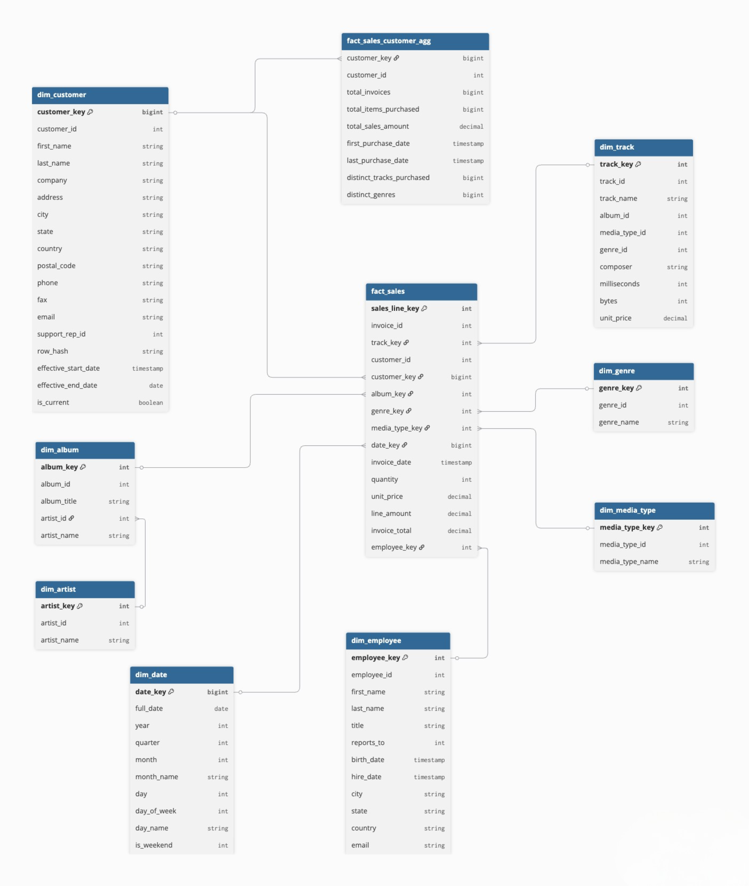

# Chinook Databricks Medallion Pipeline

## DAMG 7370 — Data Engineering Pipeline Implementation

### Team Members
- Aravind Ravi
- Vivek Nikam
- Aditya Rajesh Hasija

---

## Project Overview

This project implements a **metadata-driven, end-to-end data engineering pipeline** using the Chinook digital music store dataset on Databricks. The pipeline follows the **Medallion Architecture** (Raw → Bronze → Silver → Gold) and includes data quality profiling, quarantine handling, SCD Type 2 change tracking, and fully orchestrated job execution.

**Source:** Azure SQL Database (`damg7370-DB`)  
**Platform:** Databricks (Unity Catalog, Serverless Compute)  
**Dataset:** Chinook — 11 tables, 15,607 rows  

---

## Architecture

```
Azure SQL (Chinook)
    │
    ▼  Lakehouse Federation (Connection Manager)
 01_extract_from_source
    │
    ▼
 02_load_raw → Parquet snapshots (/Volumes/workspace/raw_zone/chinook/)
    │
    ▼
 03_raw_to_bronze → Delta tables (exact copy, no transforms)
    │
    ▼
 04_bronze_to_silver → DQ profiling + validation + quarantine + cleaning
    │
    ▼
 05_silver_to_gold → Star schema (8 dims + 2 facts + SCD Type 2)
```

---

## Key Features

| Feature | Implementation |
|---------|---------------|
| Source Connectivity | Databricks Connection Manager (Lakehouse Federation) |
| Raw Layer | Immutable Parquet snapshots with timestamped paths |
| Bronze Layer | Delta tables, exact copy of Raw, overwrite mode |
| Data Quality | 28 DQ rules, profiling, quarantine + logging |
| Silver Cleaning | DataFrame transformations: trim, lowercase, null handling, dedup |
| Gold Model | Star schema with 8 dimensions and 2 fact tables |
| SCD Type 2 | dim_customer with SHA-256 hash change detection |
| Metadata | Parent config table + child execution metrics + DQ log |
| Parameterization | 4 widget params per notebook, passed via Job config |
| Orchestration | Databricks Job with 5 tasks, linear dependencies, email alerts |

---

## Repository Structure

```
chinook-databricks-pipeline/
│
├── notebooks/
│   ├── 00_setup_metadata.py
│   ├── 01_extract_from_source.py
│   ├── 02_load_raw.py
│   ├── 03_raw_to_bronze.py
│   ├── 04_bronze_to_silver.py
│   └── 05_silver_to_gold.py
│
├── sql/
│   ├── 01_databricks_scd2_verification.sql
│   ├── 02_databricks_gold_validation.sql
│   ├── 03_databricks_metadata_dq_validation.sql
│   ├── 04_databricks_row_count_reconciliation.sql
│   ├── 05_databricks_silver_sample_queries.sql
│   ├── 06_azure_sql_version2_customer_updates.sql
│   ├── 07_azure_sql_gold_dimensional_model_ddl.sql
│   └── 08_azure_sql_source_row_count_verification.sql
│
├── docs/
│   ├── Chinook_Mapping_Document.xlsx
│   ├── Chinook_Pipeline_Documentation.docx
│   ├── DimensionalModel.png
│   └── screenshots/
│
├── export_pdf/
│   └── (Notebook PDF exports)
│
├── submission/
│   └── team_submission.zip
│
└── README.md
```

---

## Dimensional Model



### Dimensions
| Table | Rows | Description |
|-------|------|-------------|
| dim_customer | 59+ | SCD Type 2 — tracks historical changes |
| dim_track | 3,503 | Track name, composer, duration, price |
| dim_album | 347 | Album with denormalized artist name |
| dim_artist | 275 | Artist/band reference |
| dim_genre | 25 | Music genre |
| dim_media_type | 5 | Audio format |
| dim_employee | 8 | Support representatives |
| dim_date | 1,826 | Calendar dimension (2009–2013) |

### Facts
| Table | Rows | Grain |
|-------|------|-------|
| fact_sales | 2,240 | One row per invoice line |
| fact_sales_customer_agg | 59 | Customer-level aggregation (built from fact_sales) |

---

## SCD Type 2 — dim_customer

Three SCD2 columns track customer history:

| Column | Type | Purpose |
|--------|------|---------|
| effective_start_date | TIMESTAMP | When this version became active |
| effective_end_date | DATE | 9999-12-31 for current; close date for historical |
| is_current | BOOLEAN | true = active, false = closed |

**Change detection:** SHA-256 hash over 12 tracked attributes. When a customer's attributes change between pipeline runs, the old record is closed and a new active record is inserted.

---

## Pipeline Execution

### Prerequisites
- Databricks workspace with Unity Catalog
- Azure SQL Database with Chinook dataset loaded
- Connection Manager configured (`chinook_azure_sql`)

### Naming Conventions
| Object | Path |
|--------|------|
| Catalog | `workspace` |
| Raw Schema | `workspace.raw_zone` |
| Raw Volume | `workspace.raw_zone.chinook` |
| Bronze | `workspace.bronze` |
| Silver | `workspace.silver` |
| Gold | `workspace.gold` |
| Metadata | `workspace.metadata` |
| Quarantine | `workspace.quarantine` |
| Federation | `chinook_azure_sql_catalog` |

### Run Order
1. Run `00_setup_metadata` once (creates schemas, volume, metadata tables)
2. Run notebooks 01–05 in sequence, or use the Databricks Job

### Job Configuration
- **Job name:** `chinook_medallion_pipeline`
- **Tasks:** 5 linearly dependent tasks
- **Parameters:** catalog_name, schema_name, base_path, table_name
- **Notifications:** Email on success and failure
- **Concurrency:** Max 1 concurrent run

### SCD Type 2 Demo
1. Run pipeline with original data (Version 1)
2. Modify customer records in Azure SQL (`sql/06_azure_sql_version2_customer_updates.sql`)
3. Rerun pipeline
4. Verify with `sql/01_databricks_scd2_verification.sql` — changed customers show 2 rows each

---

## SQL Scripts

### Run on Databricks SQL Editor
| Script | Purpose |
|--------|---------|
| `01_databricks_scd2_verification.sql` | SCD Type 2 proof |
| `02_databricks_gold_validation.sql` | Gold row counts, orphan checks, totals |
| `03_databricks_metadata_dq_validation.sql` | Metadata and DQ log queries |
| `04_databricks_row_count_reconciliation.sql` | Cross-layer count validation |
| `05_databricks_silver_sample_queries.sql` | Silver cleaning evidence |

### Run on Azure SQL Query Editor
| Script | Purpose |
|--------|---------|
| `06_azure_sql_version2_customer_updates.sql` | Version 2 customer changes |
| `07_azure_sql_gold_dimensional_model_ddl.sql` | DDL for data modeling tools |
| `08_azure_sql_source_row_count_verification.sql` | Source data validation |

---

## Validation Results

| Check | Result |
|-------|--------|
| Source → Raw row counts | PASS — all 11 tables match |
| Raw → Bronze row counts | PASS — all 11 tables match |
| DQ rules executed | PASS — 28 rules logged |
| Silver cleaning | PASS — trim, lowercase, dedup |
| Gold model complete | PASS — 8 dims + 2 facts |
| SCD Type 2 | PASS — 3 customers show 2 versions |
| Aggregate from fact_sales | PASS — totals match (2328.60) |
| Orphan keys | PASS — zero orphans |
| Job orchestration | PASS — 2 successful runs |

---

## Submission Artifacts

- 6 Databricks notebooks (Python)
- 8 SQL validation scripts
- Mapping document (Excel, 11 sheets)
- Dimensional model diagram (PNG)
- Project documentation (Word, 18 sections)
- Notebook PDF exports
- Screenshots (37 validation screenshots)
- This README
